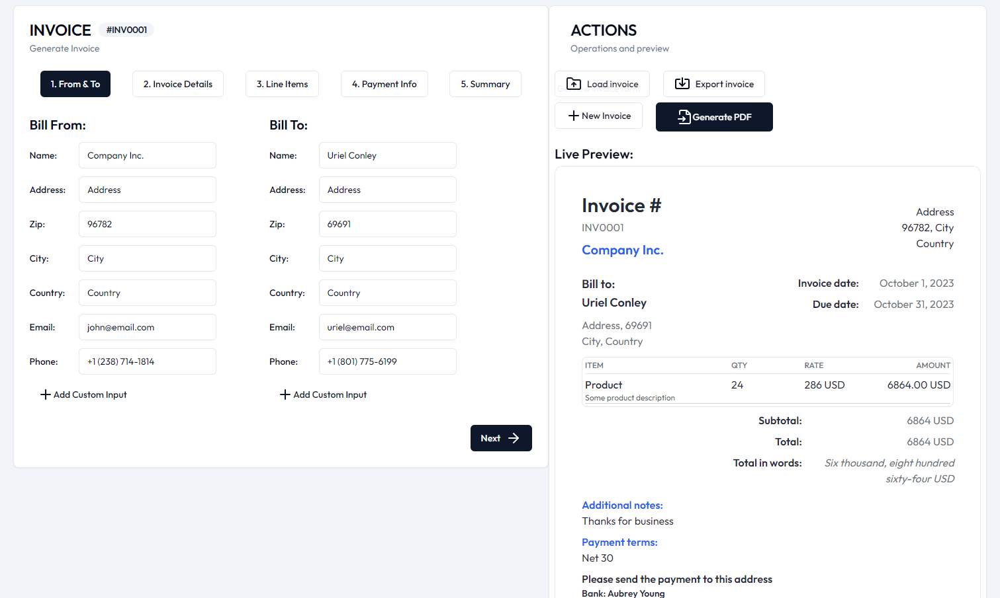

<div align="center">

  

  <p align="center">
    <strong>A modern, powerful, and intuitive invoice generator for freelancers, contractors, and businesses.</strong>
  </p>

  <p align="center">
    <a href="https://nextjs.org"></a>
    <a href="https://react.dev"></a>
    <a href="https://www.typescriptlang.org"></a>
    <a href="https://tailwindcss.com"></a>
    <a href="https://github.com/Utkarshkhandka"></a>
  </p>

</div>

---

## Overview

**Invox** is a full-featured web application designed to streamline the invoice creation and dispatch workflow. Built with the **Next.js 15 App Router**, **TypeScript**, and **Tailwind CSS**, Invox gives users a seamless experience—from live in-browser preview to pixel-perfect server-side PDF generation, multiple export formats, digital signatures, and direct email delivery.

<div align="center">
  
</div>

---

## Features

- 🧾 **Dynamic Invoice Customization**:
  - Configurable sender (*Bill From*) and recipient (*Bill To*) records.
  - Add custom key-value metadata fields to both parties.
  - Configurable invoice numbers, issue dates, due dates, and payment terms.

- 📦 **Interactive Item Management**:
  - Reorder items seamlessly via drag-and-drop powered by `@dnd-kit`.
  - Automatic calculations for subtotals, tax rates/IDs, custom discounts, and shipping fees.
  - Number-to-words total amount conversion.

- ✍️ **Digital Signatures**:
  - **Draw**: Freehand canvas signature pad.
  - **Type**: Choose from cursive calligraphy fonts (*Dancing Script*, *Alex Brush*, *Great Vibes*, *Parisienne*).
  - **Upload**: Upload an existing signature image directly.

- 📄 **Live Preview & Server-Side PDF Rendering**:
  - Interactive live preview that updates in real time as you edit.
  - High-resolution, print-ready PDF generation rendered on the server with **Puppeteer**.
  - Multiple professional invoice layouts and templates.

- 📤 **Multi-Format Export & Import**:
  - Export invoices as **PDF**, **JSON**, **CSV**, **XML**, or **XLSX (Excel)**.
  - Import previously saved **JSON** invoices to restore and edit them instantly.

- 📧 **Direct Email Delivery**:
  - Send generated invoice PDFs directly to client inboxes with one click using **Nodemailer** and **React Email**.

- 🌍 **Internationalization (i18n)**:
  - Localized in **16+ languages** (English, Spanish, French, German, Arabic, Chinese, Japanese, and more) powered by `next-intl`.
  - Global currency selection with localized number formatting.

- 💾 **Draft Persistence & Offline Support**:
  - Form drafts auto-save to browser `localStorage` to prevent loss of progress.
  - Maintain a local history of saved invoices.

- 🌓 **Theming**:
  - Built-in Dark and Light mode themes.

---

## 🛠️ Tech Stack

| Domain | Technology |
| :--- | :--- |
| **Framework** | [Next.js 15](https://nextjs.org/) (App Router) |
| **Language** | [TypeScript](https://www.typescriptlang.org/) |
| **Styling** | [Tailwind CSS](https://tailwindcss.com/), [Radix UI](https://www.radix-ui.com/) (shadcn/ui), [Lucide React](https://lucide.dev/) |
| **Forms & Validation** | [React Hook Form](https://react-hook-form.com/), [Zod](https://zod.dev/) |
| **PDF Generation** | [Puppeteer](https://pptr.dev/) & [@sparticuz/chromium](https://github.com/sparticuz/chromium) |
| **Email Service** | [Nodemailer](https://nodemailer.com/), [@react-email/components](https://react.email/) |
| **Drag & Drop** | [@dnd-kit/core](https://dndkit.com/) |
| **Internationalization** | [next-intl](https://next-intl-docs.vercel.app/) |
| **File Processing** | [xlsx](https://sheetjs.com/), [@json2csv/node](https://github.com/zemirco/json2csv), [xml2js](https://github.com/Leonidas-from-XIV/node-xml2js) |

---

## 🚀 Getting Started

### Prerequisites

Ensure you have the following installed:
- **Node.js**: `v18.17` or higher (Recommended: `v20+` or `v22+`)
- **npm**, **yarn**, or **pnpm**

### Installation

1. **Clone the repository:**
   ```bash
   git clone https://github.com/Utkarshkhandka/invox.git
   cd invox
   ```

2. **Install dependencies:**
   ```bash
   npm install
   ```

3. **Configure Environment Variables:**
   Create a `.env.local` file in the root directory:
   ```env
   # Required for local development
   NODE_ENV=development

   # Optional: Email Service Credentials (for sending PDFs via email)
   NODEMAILER_EMAIL=your-email@gmail.com
   NODEMAILER_PW=your-app-password

   # Optional: Google Search Console verification
   GOOGLE_SC_VERIFICATION=your-google-verification-code
   ```

4. **Run the Development Server:**
   ```bash
   npm run dev
   ```

5. **Open in Browser:**
   Visit [http://localhost:3000](http://localhost:3000) to view the application.

---

## 🐳 Docker Support

You can run Invox inside a container using Docker:

1. **Build the Docker image:**
   ```bash
   docker build -t invox.
   ```

2. **Run the container:**
   ```bash
   docker run -p 3000:3000 invox
   ```

3. Open [http://localhost:3000](http://localhost:3000).

---

## 📁 Project Directory Structure

```text
├── app/
│   ├── [locale]/           # Internationalized pages and root layout
│   ├── api/                # API routes (PDF generation, export, email)
│   │   └── invoice/
│   │       ├── export/     # Multi-format data export
│   │       ├── generate/   # Puppeteer PDF generator
│   │       └── send/       # Email sending endpoint
│   ├── components/         # Modals, form sections, PDF templates, UI
│   └── globals.css         # Global styles & Tailwind directives
├── components/ui/          # Reusable Shadcn/Radix UI components
├── contexts/               # React contexts (InvoiceContext, SignatureContext, etc.)
├── hooks/                  # Custom React hooks
├── i18n/                   # Next-intl configuration & locale translation files
├── lib/                    # Validation schemas (Zod), fonts, and helper functions
├── public/                 # Static assets, logos, and previews
├── services/               # Client and server invoice processing services
├── types.ts                # TypeScript interface & type declarations
└── package.json            # Project manifest & dependencies
```

---

## 📜 Available Scripts

- `npm run dev` — Starts the Next.js development server with Turbopack.
- `npm run build` — Builds the production application.
- `npm run start` — Starts the built production server.
- `npm run lint` — Runs ESLint checks across the project.
- `npm run analyze` — Runs bundle analyzer to inspect chunk sizes.

---

## 👨‍💻 Author

**Utkarsh**
- GitHub: [@Utkarshkhandka](https://github.com/Utkarshkhandka)

---

## 📄 License

This project is licensed under the [MIT License](LICENSE). Feel free to use and modify it for personal or commercial projects.
